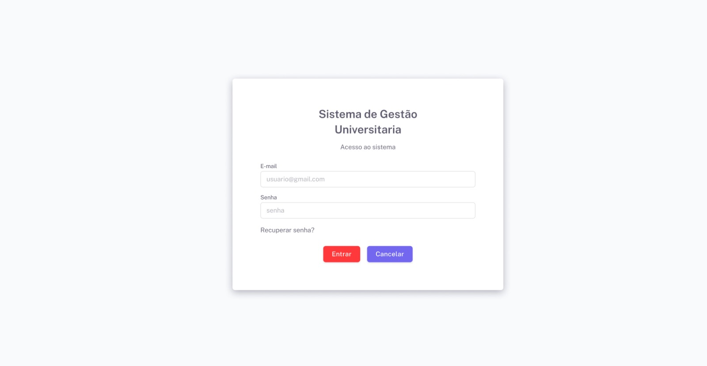

# Projeto-Integrador-Proposta-de-Sistema-Orientado-a-Objetos
Grupo 21 do Projeto Integrador de Proposta de Sistema Orientado a Objetos

# Sistema de Gestão Universitária

## Integrantes do Grupo
- Henrique Del Vecchio Garcia
- Jefferson Eidy Tokura
- Miguel Oliveira Ferreira da Silva
- Paulo Pedro Franco Netto
- Ricardo Lucas Tieppo Martins
- Tatiane Sousa da Costa
- Victor Rodrigues de Souza
- Yasmim Marie Patrício Pereira

## Protótipos de Telas

### 1. Login

### 2. Menu Principal

### 3. Cadastro de Pessoa Física

### 4. Cadastro de Pessoa Jurídica

### 5. Cadastro de Professor

### 6. Cadastro de Fornecedor

### 7. Cadastro de Aluno

